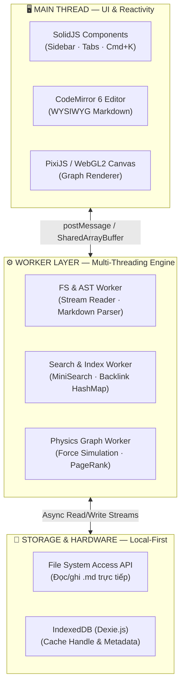

<div align="center">

# 🧠 Second Brain

### Local-First Markdown Knowledge Base & Graph Explorer

**Ứng dụng quản lý kiến thức cá nhân (PKM) chạy 100% trong trình duyệt — Zero-Cloud, Zero-Server, Zero Vendor Lock-in.**

[](https://vite.dev)
[](https://solidjs.com)
[](https://www.typescriptlang.org/)
[](https://vitest.dev)
[](https://pixijs.com)
[]()

[📘 Hướng dẫn sử dụng](./docs/USER_GUIDE.md) ·
[📐 Tài liệu kỹ thuật (PRD/Tech Spec)](./docs/Second_Brain_PKM_PRD_TechSpec.md) ·
[🐛 Báo lỗi](../../issues)

</div>

---

## 📖 Giới thiệu

**Second Brain** là nền tảng Quản lý Kiến thức Cá nhân (PKM) theo phương pháp **Zettelkasten**, được xây dựng để giải quyết bài toán mà các công cụ hiện tại chưa làm tốt:

- **Notion, Roam Research** → Cloud-first, chậm khi dữ liệu lớn, rủi ro khóa dữ liệu (vendor lock-in).
- **Obsidian** → Native, nhanh, nhưng dựa trên Electron nặng nề, tốn RAM.
- **Second Brain** → Chạy **thuần trên trình duyệt web** (Pure Web Engine), đọc/ghi trực tiếp file `.md` trên ổ cứng qua **File System Access API**, không cần cài đặt, không cần máy chủ, không cần tài khoản.

> 🎯 Mục tiêu hiệu năng: gõ phím độ trễ < 16.6ms (60 FPS), tìm kiếm toàn văn bản < 16ms, Graph View mượt ở 60 FPS với hàng nghìn node — xem chi tiết ngân sách hiệu năng tại [Tech Spec §4](./docs/Second_Brain_PKM_PRD_TechSpec.md).

---

## ✨ Tính năng nổi bật

| | Tính năng | Mô tả |
| :-: | --- | --- |
| ✍️ | **Editor Markdown (CodeMirror 6)** | Soạn thảo mượt mà với hiệu ứng WYSIWYG nhẹ (tiêu đề, in đậm) render trực tiếp khi gõ. |
| 🔗 | **Liên kết hai chiều `[[...]]`** | Tạo liên kết giữa các ghi chú tức thì; tự động xây **Backlinks HashMap** tra cứu O(1). |
| 🕸️ | **Graph View (WebGL2)** | Trực quan hóa mạng lưới kiến thức bằng PixiJS + thuật toán mô phỏng lực (force-directed layout) chạy trên Web Worker riêng biệt. |
| 🔍 | **Tìm kiếm tức thì (`Cmd/Ctrl+K`)** | Full-text search bằng MiniSearch — hỗ trợ prefix search, fuzzy search (chịu lỗi chính tả) và boost theo tiêu đề/tag. |
| 💾 | **Local-First thực thụ** | Đọc/ghi trực tiếp file `.md` qua File System Access API — không upload, không server, không khóa định dạng. |
| ⚡ | **Kiến trúc đa luồng (Multi-Threaded)** | Toàn bộ tác vụ nặng (parse AST, tính vật lý đồ thị, index tìm kiếm) chạy trên **Web Workers**, giữ UI Thread luôn mượt 60 FPS. |
| 🗄️ | **Cache thông minh (Dexie/IndexedDB)** | Lưu tham chiếu thư mục Vault để tự kết nối lại ở phiên làm việc sau, không cần chọn lại folder. |

> ℹ️ Một số tính năng đang trong quá trình hoàn thiện UI (ví dụ: kết nối "Mở Vault" trực tiếp với giao diện). Xem bảng trạng thái chi tiết tại [docs/USER_GUIDE.md §13](./docs/USER_GUIDE.md#13-trạng-thái-tính-năng-hiện-tại).

---

## 🏗️ Kiến trúc hệ thống

Ứng dụng áp dụng mô hình **Multi-Threaded Actor Architecture**, cô lập hoàn toàn UI Thread khỏi các tác vụ tính toán nặng thông qua Web Workers:



**Nguyên tắc thiết kế cốt lõi:**

1. **Zero-Copy Data Transfer** — tọa độ Graph View được ghi/đọc qua `SharedArrayBuffer` (Float32Array) thay vì serialize JSON mỗi frame, loại bỏ chi phí copy giữa Worker và Main Thread.
2. **Progressive Rendering** — index từng batch 100 file ngay khi quét xong, hiển thị UI tức thì thay vì chờ toàn bộ vault xử lý xong.
3. **Fine-Grained Reactivity** — SolidJS biên dịch thẳng ra DOM node thật, không dùng Virtual DOM, chỉ cập nhật đúng phần tử thay đổi.

---

## 🧰 Tech Stack

| Lớp | Công nghệ | Vai trò |
| --- | --- | --- |
| **Framework** | [SolidJS](https://solidjs.com) + [Vite](https://vite.dev) | UI reactivity không Virtual DOM, dev server siêu tốc |
| **Ngôn ngữ** | TypeScript (strict-friendly) | An toàn kiểu dữ liệu xuyên suốt Worker ⇄ Main Thread |
| **Editor** | [CodeMirror 6](https://codemirror.net/) | Soạn thảo Markdown, custom `ViewPlugin` cho WYSIWYG & auto-complete |
| **Graph Rendering** | [PixiJS](https://pixijs.com) (WebGL2) | Vẽ hàng nghìn node/edge với GPU shaders |
| **Physics Engine** | Custom Web Worker + `SharedArrayBuffer` | Mô phỏng lực đẩy/lực kéo (force-directed layout) |
| **Full-text Search** | [MiniSearch](https://github.com/lucaong/minisearch) | Inverted index trong bộ nhớ, hỗ trợ fuzzy & prefix search |
| **Local Storage** | File System Access API + [Dexie.js](https://dexie.org) (IndexedDB) | Đọc/ghi `.md` trực tiếp + cache metadata nhẹ |
| **Testing** | [Vitest](https://vitest.dev) + `@solidjs/testing-library` + `happy-dom` + `fake-indexeddb` | Unit test & integration test, coverage v8 |
| **Chất lượng mã nguồn** | ESLint 10 (`typescript-eslint`) · Prettier · Husky · lint-staged | Kiểm tra & format tự động trước mỗi commit |

---

## 🚀 Bắt đầu nhanh

### Yêu cầu

- **Node.js ≥ 20**
- Trình duyệt **Chromium** (Chrome / Edge / Brave bản mới) — bắt buộc để dùng File System Access API & SharedArrayBuffer.

### Cài đặt

```bash
git clone <repository-url>
cd second-brain
npm install
```

### Chạy môi trường phát triển

```bash
npm run dev
```

Mở [http://localhost:5173](http://localhost:5173) trên trình duyệt.

### Build production

```bash
npm run build      # tsc --noEmit && vite build
npm run preview    # xem trước bản build tại http://localhost:4173
```

> 🔒 Build production yêu cầu header `Cross-Origin-Opener-Policy: same-origin` và `Cross-Origin-Embedder-Policy: require-corp` để `SharedArrayBuffer` hoạt động (đã cấu hình sẵn cho `dev`/`preview` trong [vite.config.ts](./vite.config.ts); khi tự triển khai hosting/CDN riêng cần cấu hình lại 2 header này).

---

## 📜 Scripts

| Lệnh | Mô tả |
| --- | --- |
| `npm run dev` | Chạy dev server (hot reload) |
| `npm run build` | Type-check (`tsc --noEmit`) rồi build production vào `dist/` |
| `npm run preview` | Xem trước bản build production |
| `npm run test` | Chạy bộ test bằng Vitest (watch mode) |
| `npm run test:ui` | Mở giao diện Vitest UI |
| `npm run test:coverage` | Chạy test kèm báo cáo coverage (v8) |
| `npm run lint` | Kiểm tra lỗi ESLint (`--max-warnings=0`) |
| `npm run lint:fix` | Tự động sửa lỗi ESLint |
| `npm run format` | Format code bằng Prettier |

---

## 🧪 Kiểm thử & chất lượng mã nguồn

Dự án áp dụng ngưỡng coverage khắt khe (cấu hình tại [vitest.config.ts](./vitest.config.ts)):

| Metric | Ngưỡng tối thiểu |
| --- | --- |
| Statements | 85% |
| Branches | 80% |
| Functions | 90% |
| Lines | 85% |

Bộ test được tổ chức theo `tests/`:

```
tests/
├── components/      # Unit test cho Editor, Graph View
├── integration/     # Test tích hợp toàn App Shell & milestone từng sprint
├── mocks/           # Giả lập File System Access API, dữ liệu vault khổng lồ
├── storages/        # Test tầng lưu trữ (FS wrapper)
└── workers/         # Test AST parser, physics engine, search engine, benchmark hiệu năng
```

`husky` + `lint-staged` tự động chạy Prettier, ESLint và các test liên quan trên từng file trước mỗi commit.

```bash
npm run test              # chạy toàn bộ test
npm run test:coverage     # kèm báo cáo coverage HTML tại coverage/index.html
```

---

## 📂 Cấu trúc thư mục

```
second-brain/
├── docs/                          # Tài liệu dự án (PRD, Tech Spec, User Guide)
├── src/
│   ├── App.tsx                    # App Shell chính (sidebar, tabs, modal)
│   ├── components/
│   │   ├── Editor/                # CodeMirror 6 editor + plugin WYSIWYG
│   │   ├── Graph/                 # GraphView (PixiJS WebGL2)
│   │   └── Search/                # SearchModal (Cmd+K)
│   ├── storages/                  # File System Access API wrapper + Dexie cache
│   ├── store/                     # SolidJS store (state toàn cục)
│   └── workers/                   # AST parser, Search engine, Physics engine (Web Workers)
├── tests/                         # Unit & integration tests (Vitest)
├── vite.config.ts                 # Cấu hình Vite (alias @/, COOP/COEP headers, chunking)
└── vitest.config.ts               # Cấu hình Vitest (coverage thresholds, môi trường happy-dom)
```

---

## 🌐 Hỗ trợ trình duyệt

| Trình duyệt | Hỗ trợ |
| --- | --- |
| Chrome / Edge / Brave (Chromium mới) | ✅ Đầy đủ (File System Access API + SharedArrayBuffer) |
| Firefox | ⚠️ Hạn chế — chưa hỗ trợ đầy đủ File System Access API |
| Safari | ⚠️ Hạn chế — chưa hỗ trợ đầy đủ File System Access API |

---

## 🗺️ Lộ trình phát triển

Xem chi tiết Scope Matrix và lộ trình 6 tuần (Sprint 1–3) tại [docs/Second_Brain_PKM_PRD_TechSpec.md](./docs/Second_Brain_PKM_PRD_TechSpec.md#part-3-implementation-plan--scope-matrix). Tóm tắt:

- ✅ **Sprint 1** — Local Storage Engine, FS & AST Worker Pipeline, Dexie Metadata Cache.
- ✅ **Sprint 2** — CodeMirror 6 WYSIWYG Editor, Bi-Directional Linking, Backlinks Engine.
- ✅ **Sprint 3** — WebGL Force-Directed Graph View, Full-text Search Engine (`Cmd+K`).
- 🚧 **Đang tiếp tục** — Kết nối UI "Mở Vault" trực tiếp với ổ cứng thật, Backlinks Panel UI, đa Vault, xuất/nhập dữ liệu.

---

## 📚 Tài liệu liên quan

| Tài liệu | Nội dung |
| --- | --- |
| [docs/USER_GUIDE.md](./docs/USER_GUIDE.md) | Hướng dẫn sử dụng đầy đủ dành cho người dùng cuối |
| [docs/Second_Brain_PKM_PRD_TechSpec.md](./docs/Second_Brain_PKM_PRD_TechSpec.md) | PRD, kiến trúc kỹ thuật chi tiết, Scope Matrix, lộ trình Sprint |

---

## 🤝 Đóng góp

Đây hiện là dự án cá nhân (`"private": true`). Nếu bạn muốn đóng góp:

1. Fork repository và tạo branch tính năng: `git checkout -b feature/ten-tinh-nang`.
2. Đảm bảo `npm run lint` và `npm run test` đều pass trước khi commit (được `husky` tự kiểm tra).
3. Mở Pull Request kèm mô tả rõ ràng về thay đổi.

## 📄 Giấy phép

Dự án cá nhân, hiện chưa công bố giấy phép mã nguồn mở (`private: true` trong `package.json`).
